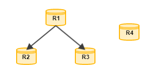
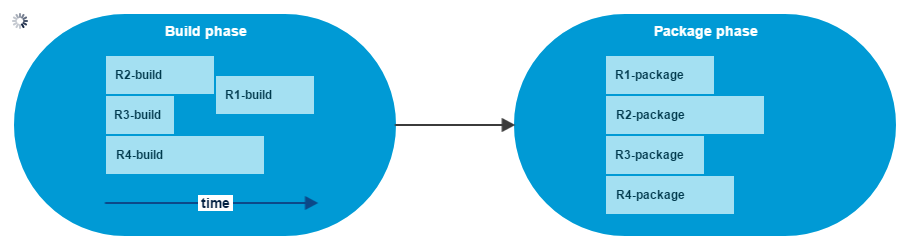

class: center
# What is that?

---

class: center
# What is that?

---
# State of JMOAB with maven

- March 2017
  - 239 repositories
  - 652 projects
  - 2h+ for a new change in the JMOAB to be deployable
  - 3h for a presubmit on parent-poms

---
# State of JMOAB with maven

- .side[]March 2017
  - 239 repositories
  - 652 projects
  - 2h+ for a new change in the JMOAB to be deployable
  - 3h for a presubmit on parent-poms
  - pipeline driven by dependency graph
.center[]

---
# Why changing? It works!
--

- 239 repositories
- 652 projects
- 2h+ for a new change in the JMOAB to be deployable
- 3h for a presubmit on parent-poms
- pipeline driven by dependency graph

---
# Why changing? It works!

- 239 repositories
- 652 projects
- .red[2h+ for a new change in the JMOAB to be deployable]
- .red[3h for a presubmit on parent-poms]
- pipeline driven by dependency graph

.center[]
---
# Why changing? It works!

- 239 repositories
- 652 projects
- .red[2h+ for a new change in the JMOAB to be deployable]
- .red[3h for a presubmit on parent-poms]
- pipeline driven by dependency graph
- .red[poms are not maintainable]

???
To Ion
---
