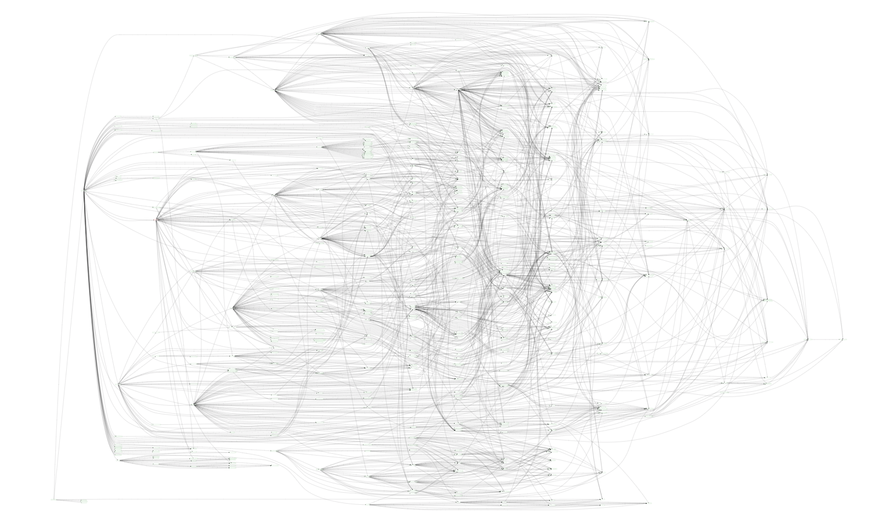
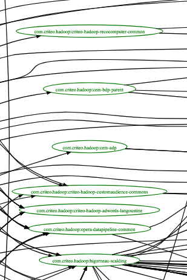

class: center
# What is that?

---

class: center
# What is that?

---

# State of JMOAB with maven

- March 2017
  - 239 repositories
  - 652 projects
  - 2h+ for a new change in the JMOAB to be deployable
  - 3h for a presubmit on parent-poms

---
# State of JMOAB with maven

- March 2017
  - 239 repositories
  - 652 projects
  - .red[2h+ for a new change in the JMOAB to be deployable]
  - .red[3h for a presubmit on parent-poms]

---
# Why changing? It works!

- Yes, but:
  - presubmit and build too slow
  - developers report local build times too slow
  - poms are not maintainable

.center[]
.center[XKCD]

---
