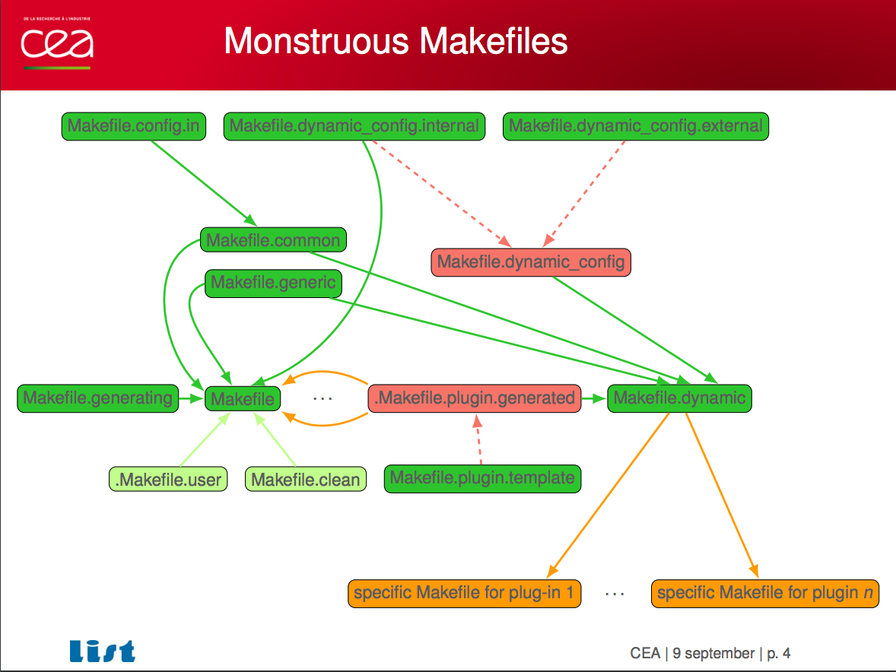

# State of the art

When is a build system annoying?

--
  * always?


[Build systems à la carte/Microsoft research](https://www.microsoft.com/en-us/research/uploads/prod/2018/03/build-systems-a-la-carte.pdf)

```
Build systems (such as Make) are big, complicated, and used by every software
developer on the planet. But they are a sadly unloved part of the software
ecosystem, very much a means to an end, and seldom the focus of attention.
```
--

At least, when it's
  * not maintainable

--

  * slow

---
# State of the art

(Let's not complain about parent poms)

.center[]

.center[ [CEA/FramaC](http://gallium.inria.fr/~scherer/events/jbuilder-design-session-sep-09-2017/slides-bobot-frama-C.pdf)
]

---
# State of the art

Let's have the following DAG of tasks.

```groovy
JMOABProject(A, build)
├── JMOABProject(B, build)
│   ├── JMOABProject(B, test)
│   └── JMOABProject(E, build)
├── JMOABProject(A, test)
├── JMOABProject(C, build)
│   └── JMOABProject(G, build)
└── JMOABProject(D, build)
    ├── JMOABProject(D, test)
    └── JMOABProject(F, build)
```

---
# State of the art

How mvn schedules it. .side[1]

```groovy
JMOABProject(A, build) *
├── JMOABProject(B, build)
│   ├── JMOABProject(B, test)
│   └── JMOABProject(E, build)
├── JMOABProject(A, test)
├── JMOABProject(C, build)
│   └── JMOABProject(G, build)
└── JMOABProject(D, build)
    ├── JMOABProject(D, test)
    └── JMOABProject(F, build)
```
---
# State of the art

How mvn schedules it. .side[2]

```groovy
JMOABProject(A, build)
├── JMOABProject(B, build)
│   ├── JMOABProject(B, test)
│   └── JMOABProject(E, build)
├── JMOABProject(A, test) *
├── JMOABProject(C, build)
│   └── JMOABProject(G, build)
└── JMOABProject(D, build)
    ├── JMOABProject(D, test)
    └── JMOABProject(F, build)
```
---
# State of the art

How mvn schedules it. .side[3]

```groovy
JMOABProject(A, build)
├── JMOABProject(B, build) *
│   ├── JMOABProject(B, test)
│   └── JMOABProject(E, build)
├── JMOABProject(A, test)
├── JMOABProject(C, build)
│   └── JMOABProject(G, build)
└── JMOABProject(D, build)
    ├── JMOABProject(D, test)
    └── JMOABProject(F, build)
```
---
# State of the art

How mvn schedules it. .side[4]

```groovy
JMOABProject(A, build)
├── JMOABProject(B, build)
│   ├── JMOABProject(B, test) *
│   └── JMOABProject(E, build)
├── JMOABProject(A, test)
├── JMOABProject(C, build)
│   └── JMOABProject(G, build)
└── JMOABProject(D, build)
    ├── JMOABProject(D, test)
    └── JMOABProject(F, build)
```
---
# State of the art

How mvn schedules it. .side[5]

```groovy
JMOABProject(A, build)
├── JMOABProject(B, build)
│   ├── JMOABProject(B, test)
│   └── JMOABProject(E, build)
├── JMOABProject(A, test)
├── JMOABProject(C, build) *
│   └── JMOABProject(G, build)
└── JMOABProject(D, build)
    ├── JMOABProject(D, test)
    └── JMOABProject(F, build)
```
---
# State of the art

How mvn schedules it. .side[6]

```groovy
JMOABProject(A, build)
├── JMOABProject(B, build)
│   ├── JMOABProject(B, test)
│   └── JMOABProject(E, build)
├── JMOABProject(A, test)
├── JMOABProject(C, build)
│   └── JMOABProject(G, build)
└── JMOABProject(D, build) *
    ├── JMOABProject(D, test)
    └── JMOABProject(F, build)
```
---
# State of the art

How mvn schedules it. .side[7]

```groovy
JMOABProject(A, build)
├── JMOABProject(B, build)
│   ├── JMOABProject(B, test)
│   └── JMOABProject(E, build)
├── JMOABProject(A, test)
├── JMOABProject(C, build)
│   └── JMOABProject(G, build)
└── JMOABProject(D, build)
    ├── JMOABProject(D, test) *
    └── JMOABProject(F, build)
```
---
# State of the art

How mvn schedules it. .side[8]

```groovy
JMOABProject(A, build)
├── JMOABProject(B, build)
│   ├── JMOABProject(B, test)
│   └── JMOABProject(E, build) *
├── JMOABProject(A, test)
├── JMOABProject(C, build)
│   └── JMOABProject(G, build)
└── JMOABProject(D, build)
    ├── JMOABProject(D, test)
    └── JMOABProject(F, build)
```
---
# State of the art

How mvn schedules it. .side[9]

```groovy
JMOABProject(A, build)
├── JMOABProject(B, build)
│   ├── JMOABProject(B, test)
│   └── JMOABProject(E, build)
├── JMOABProject(A, test)
├── JMOABProject(C, build)
│   └── JMOABProject(G, build)
└── JMOABProject(D, build)
    ├── JMOABProject(D, test)
    └── JMOABProject(F, build) *
```
---
# State of the art

How mvn schedules it. .side[10]

```groovy
JMOABProject(A, build)
├── JMOABProject(B, build)
│   ├── JMOABProject(B, test)
│   └── JMOABProject(E, build) *
├── JMOABProject(A, test)
├── JMOABProject(C, build)
│   └── JMOABProject(G, build)
└── JMOABProject(D, build)
    ├── JMOABProject(D, test)
    └── JMOABProject(F, build)
```

---
# State of the art

How it could be scheduled. .side[1]

```groovy
JMOABProject(A, build) *
├── JMOABProject(B, build)
│   ├── JMOABProject(B, test)
│   └── JMOABProject(E, build)
├── JMOABProject(A, test)
├── JMOABProject(C, build)
│   └── JMOABProject(G, build)
└── JMOABProject(D, build)
    ├── JMOABProject(D, test)
    └── JMOABProject(F, build)
```

---
# State of the art

How it could be scheduled. .side[2]

```groovy
JMOABProject(A, build)
├── JMOABProject(B, build) *
│   ├── JMOABProject(B, test)
│   └── JMOABProject(E, build)
├── JMOABProject(A, test) *
├── JMOABProject(C, build) *
│   └── JMOABProject(G, build)
└── JMOABProject(D, build) *
    ├── JMOABProject(D, test)
    └── JMOABProject(F, build)
```

---
# State of the art

How it could be scheduled. .side[3]

```groovy
JMOABProject(A, build)
├── JMOABProject(B, build)
│   ├── JMOABProject(B, test) *
│   └── JMOABProject(E, build) *
├── JMOABProject(A, test) *
├── JMOABProject(C, build) *
│   └── JMOABProject(G, build)
└── JMOABProject(D, build) *
    ├── JMOABProject(D, test)
    └── JMOABProject(F, build)
```

---
# State of the art

How it could be scheduled. .side[4]

```groovy
JMOABProject(A, build)
├── JMOABProject(B, build)
│   ├── JMOABProject(B, test)
│   └── JMOABProject(E, build)
├── JMOABProject(A, test) *
├── JMOABProject(C, build) *
│   └── JMOABProject(G, build)
└── JMOABProject(D, build)
    ├── JMOABProject(D, test) *
    └── JMOABProject(F, build) *
```

---
# State of the art

How it could be scheduled. .side[5]

```groovy
JMOABProject(A, build)
├── JMOABProject(B, build)
│   ├── JMOABProject(B, test)
│   └── JMOABProject(E, build)
├── JMOABProject(A, test)
├── JMOABProject(C, build) *
│   └── JMOABProject(G, build)
└── JMOABProject(D, build)
    ├── JMOABProject(D, test) *
    └── JMOABProject(F, build) *
```

---
# State of the art

How it could be scheduled. .side[6]

```groovy
JMOABProject(A, build)
├── JMOABProject(B, build)
│   ├── JMOABProject(B, test)
│   └── JMOABProject(E, build)
├── JMOABProject(A, test)
├── JMOABProject(C, build)
│   └── JMOABProject(G, build) *
└── JMOABProject(D, build)
    ├── JMOABProject(D, test)
    └── JMOABProject(F, build)
```

---
# State of the art

In the next build, changes are only done in G's files.
With the standard
```shell
$ mvn clean install
```

it builds everything in sequence again.

--

But, only G should be built.
```groovy
JMOABProject(A, build)
├── JMOABProject(B, build)
│   ├── JMOABProject(B, test)
│   └── JMOABProject(E, build)
├── JMOABProject(A, test)
├── JMOABProject(C, build)
│   └── JMOABProject(G, build) *
└── JMOABProject(D, build)
    ├── JMOABProject(D, test)
    └── JMOABProject(F, build)
```


---
# State of the art


__Bazel__ (Google)

* DAG in parallel

--
* distributed cache

--
* scala support not mature

--
* no resolution of version conflicts on external dependencies

--
* no maven plugin equivalent ([~45 maven plugin jmoab](https://confluence.criteois.com/display/RP/Maven+plugins+and+their+Gradle+equivalent))

--

__Pants, Buck__ (Twitter/Facebook):

```
Pants, Buck: Both tools were created and developed by ex-Googlers at Twitter and Foursquare,
and Facebook respectively. They have been modeled after Bazel, but their feature
sets are different, so they aren't viable alternatives for us.
```

---

# State of the art
__Blaze at Google__

* Same as Bazel +

--
.side[]

* distributed execution of the DAG: hundreds of cpus available for your build.

--

  * [Your build in a datacenter](https://archive.fosdem.org/2018/schedule/event/datacenter_build/attachments/slides/2514/export/events/attachments/datacenter_build/slides/2514/bazel_fosdem_2018_final.pdf) (Uber, Twitter, TwoSigma + Google support)


---
# State of the art

__Sbt__
* scala only
* no disributed build
* Linkedin migrated sbt to gradle and reports 400% of [improvement](https://engineering.linkedin.com/blog/2018/07/how-we-improved-build-time-by-400-percent).
* why not [mill](https://github.com/lihaoyi/mill)?

__Gradle__

* DAG of tasks executed in parallel

* Distributed cache (if tasks support it)

* Many maven plugins ported to gradle

* Good community (Linkedin/Netflix/Android, backed by google on it)

--

* Distributed builds?

--

  * [post in gradle forum 2011/Sep](https://discuss.gradle.org/t/parallel-and-distributed-execution)
  * first features may come in 2019 (in gradle enterprise?).

---
# The choice

|                 | DAG //         | Incremental Build | Distributed cache | Distributed build | Version conflict resolution | Maven plugins converted |
|-----------------|:--------------:|:-----------------:|:-----------------:|:-----------------:|:---------------------------:|:-----------------------:|
| Blaze at Google | *              | *                 | *                 | *                 |                             |                         |
| Gradle          | *              | Per task          | Per task          |                   | *                           | *                       |

---
