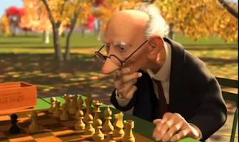

# 6 months in

- Complete new pipeline (JMOAB2)
  triggered for each JMOAB

    - conversion

--
    - build

--
    - test

--
    - comparison of number of tests / produced artifacts (dashboard)

--
    - conversations with gradle ([@oehme](https://github.com/oehme), [@melix](https://github.com/melix), [@hansdockter](https://www.linkedin.com/in/hansdockter))

--

- December 2017: We start "plateauing" at **80%** conversion

--

.center[]

???
Pretty bumed.
January, keep working while trying to come up with alternatives.
What's better than fresh (literally) air?

---
