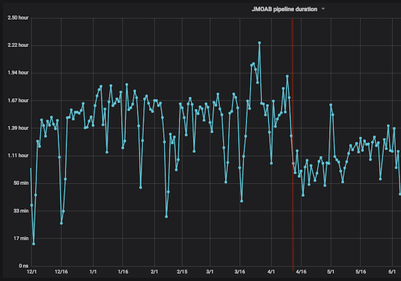
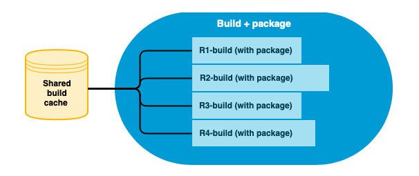
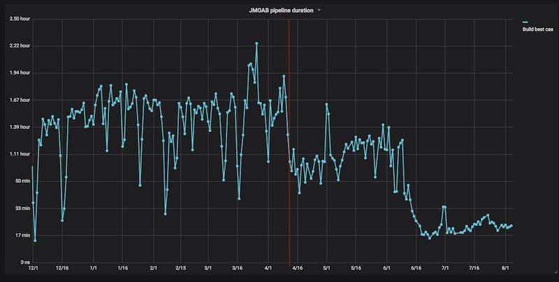

# Agenda

- **March-July 2017**: Coming up with the plan

- **August-December 2017**: Going for the big bang

- **December 2017**: a crisis of faith

- .red[**January-June 2018**: new ideas]

- **July 2018 - ?**: full scale migration

- Lessons learned
---
# Mixed moab: a Ann Arbor story part I

--

- The big bang thing doesn't look good

- How to bootstrap things using what we have?

--

- Flying Bridge to Ann Arbor / Beers
.side[]
- An idea while there:

   - a BuildWithMavenPlugin
   - use the converted gradle projects
   - replace compilation steps with calls to Maven

???
- Lonely nights at the hotel
- Not so lonely nights at the bar
- -7 -> +1 Celsius

???
- Lonely nights at the hotel
- Not so lonely nights at the bar
- -7 -> +1 Celsius

--

- April 2018, JMOAB 1.5 is born!

---
class: center
# An image = a thousand words

???
The performance before the jump doesn't include the packaging step.
The one after the jump does.

---
# JMOAB 1.5

- We have a complete gradle pipeline
- Build times are better
- We can start migration using the converter:

--

- May 2018: [Perpetuo](http://review.criteois.lan/#/c/346423/) is the first gradle repository

--

- June 2018:
   - .side[]Switch to parallel pipeline
   - implementing a distributed gradle cache on maven tasks
   - June 15th: WOOT WOOT mail: presubmit faster

---
class: center
# JMOAB 1.6

---
# Mixed moab: a Ann Arbor story part II: JMOAB 1.8

--
- JMOAB 1.6 works great on CI, but does not work with converted projects using protobuf.
- Impossible to use for devs
- Idea: why not parse the poms directly from gradle?

???
It is a problem that devs can't use a mixed workspace because that means that all repos they work on must be converted before they can switch.

--

- Second Flying Bridge / More beers
- Full mixed gradle/maven support without converter

--

- Time to start cracking on that conversion...

---
