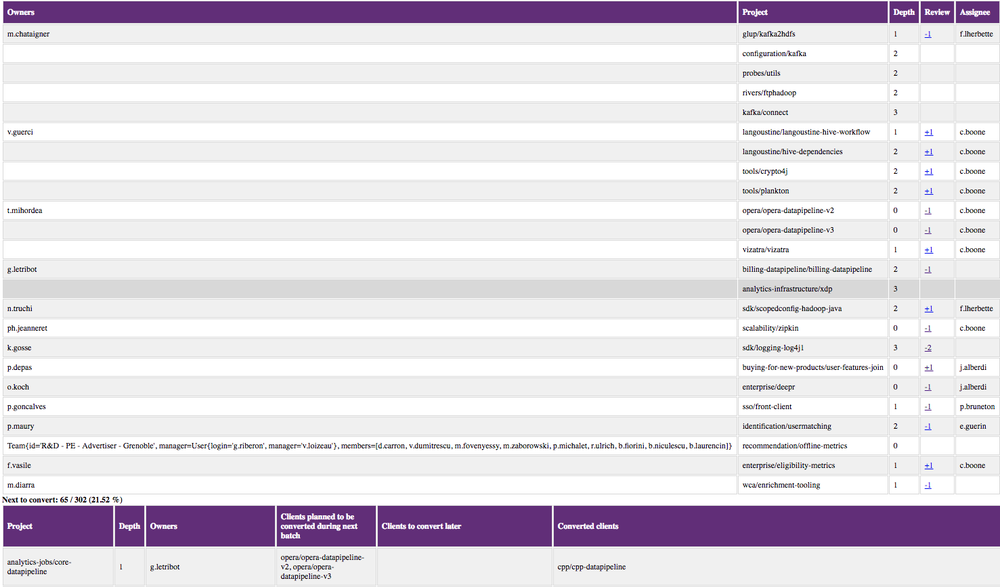
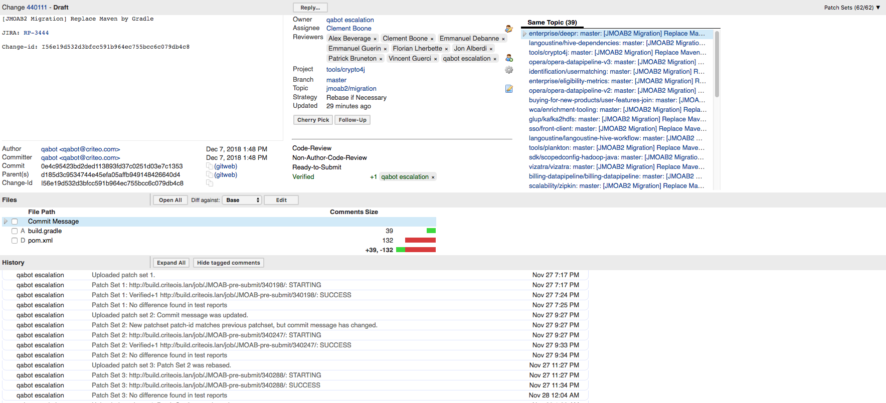
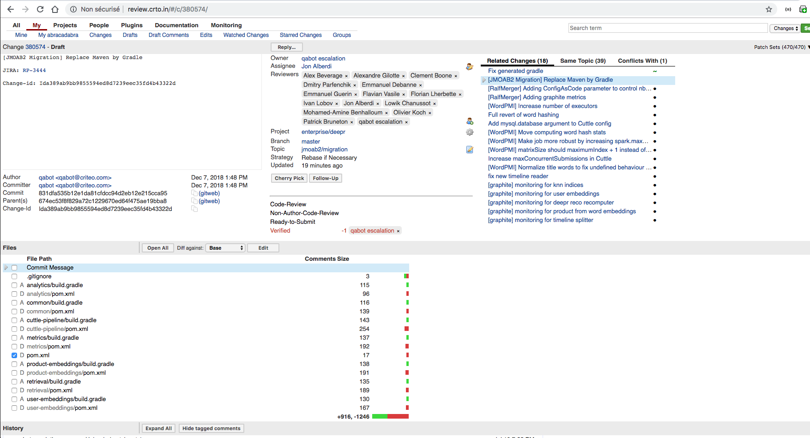
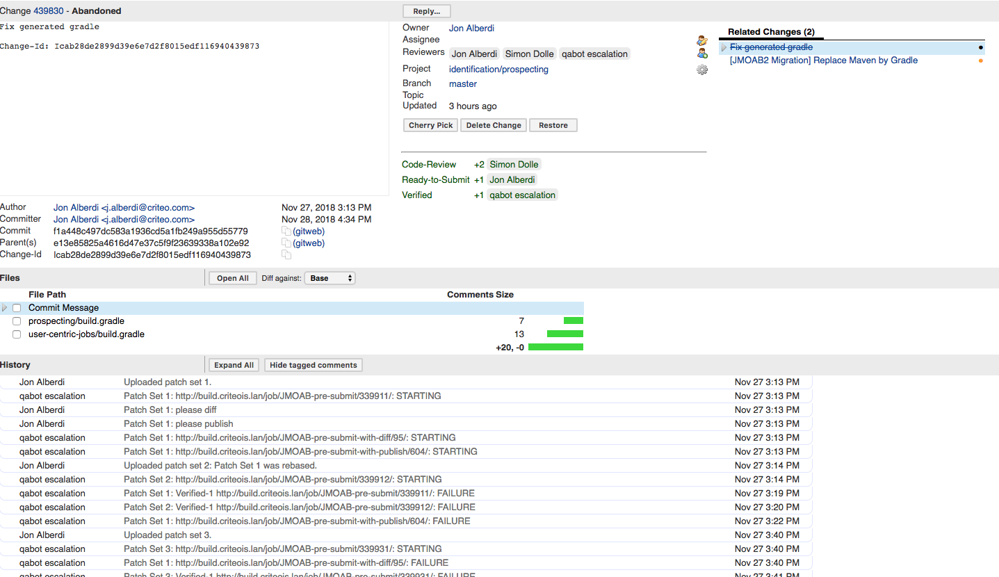
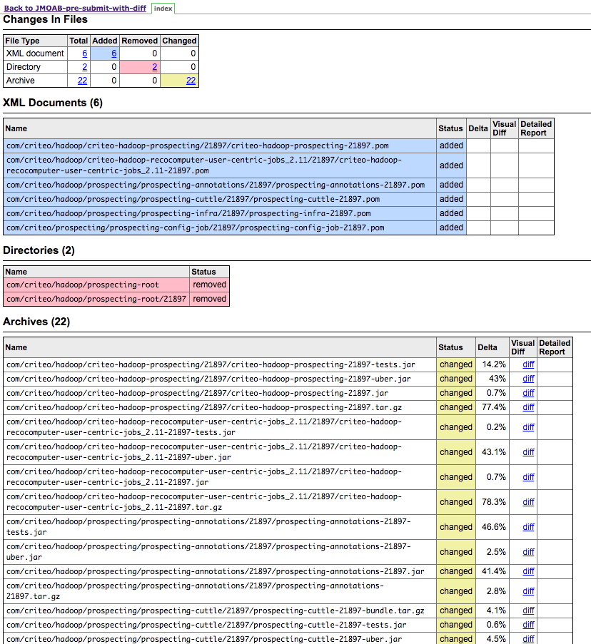

# Industrialize migration

* Jobs emulating all cases, bugs found when maven depends on gradle.
* Schedule the migration from the leaves.
* Topo-sort computed, changes continuously generated /rebased on non migrated leaves only.
* Find owner of each repo...
* Build-services members assign themselves to one repo:
  * Take contact with devlead
  * Training
  * Manual fixes, participate in integration test debugging.
* How to test:
  * tools for comparing produced artifacts
  * tools for comparing test results/numbers ("what? 0 tests in my maven project? I was SURE I had some")
* issues: scala compatibility issues, migrate existing tools (cuttle), IntelliJ integration, __classpath__ order.

---
class: center
# Industrialize migration

---

class: center
# Industrialize migration

---

class: center
# Industrialize migration

---

class: center
# Industrialize migration

---

class: center
# Industrialize migration

---
