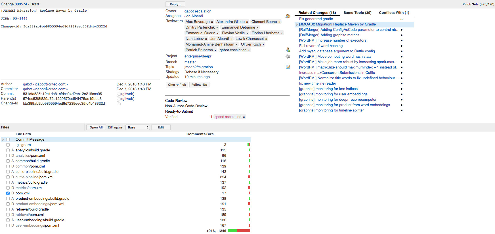
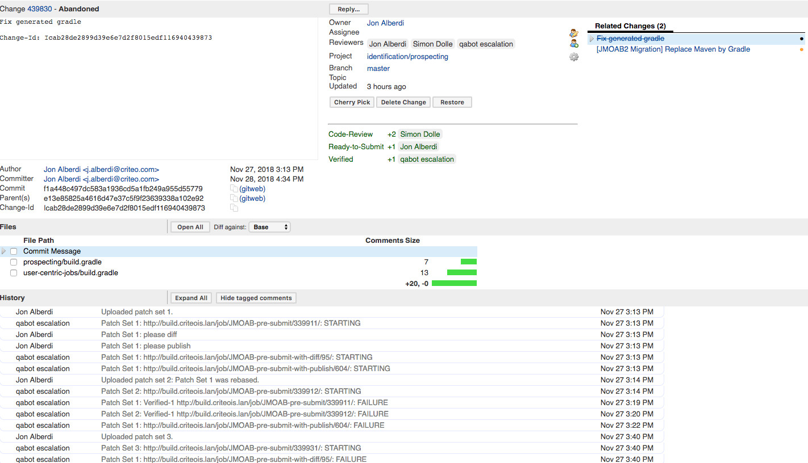
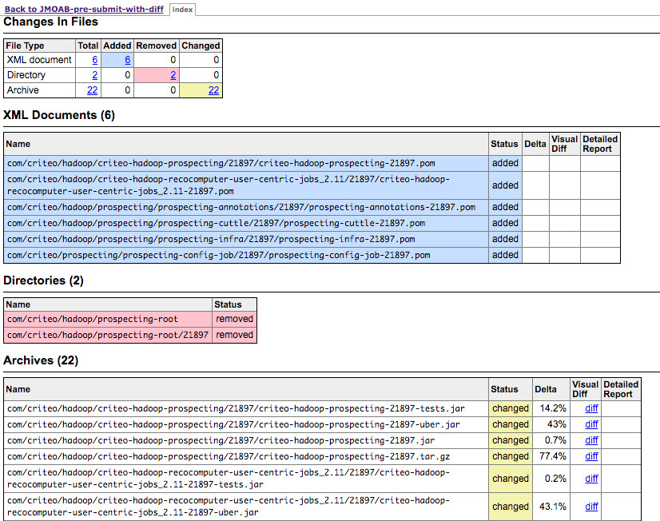

# Agenda

- **March-July 2017**: Coming up with the plan

- **August-December 2017**: Going for the big bang

- **December 2017**: a crisis of faith

- **January-June 2018**: new ideas

- .red[**July 2018 - ?**: full scale migration]

- Lessons learned
---
# Industrialize migration

* Jobs emulating all cases, bugs found when maven depends on gradle: Schedule the migration from the leaves.

--
* Topo-sort computed, changes continuously generated /rebased on non migrated leaves only.

--
* Find owner of each repo...

--
* Build-services members assign themselves to one repo:
  * Take contact with devlead
  * Training
  * Manual fixes, participate in integration test debugging.

--
* Maven/Gradle comparison tooling:
  * please diff
  * test results/numbers ("what? 0 tests in my maven project? I was SURE I had some")
  * please publish
  * findJars

--
* issues: scala compatibility, IntelliJ integration...

--
  * .red[__classpath__ __order__]

---
class: center
# Industrialize migration

---

class: center
# Industrialize migration

---

class: center
# Industrialize migration

---

class: center
# Industrialize migration

---

class: center
# Industrialize migration

---
