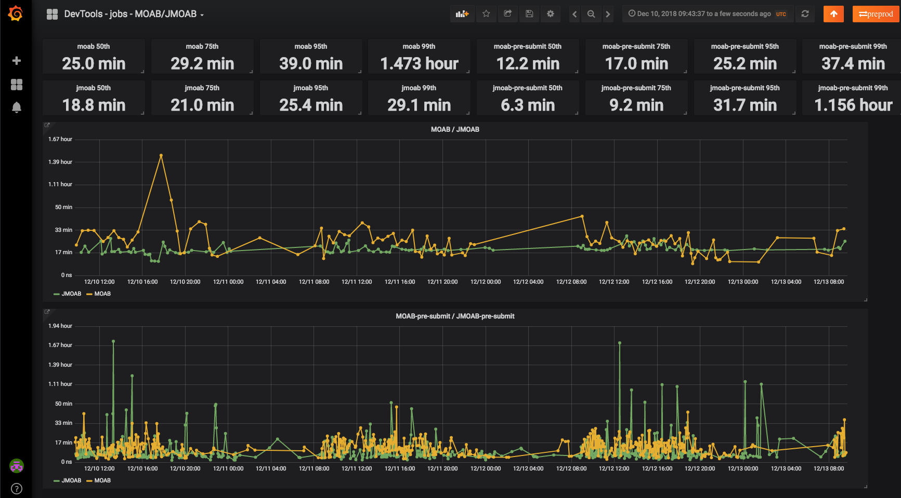

# Reached goals

--

* Reduce the duration of JMOAB-build to less than 30 minutes.

--
.red[NO]

--

* Reduce the duration of JMOAB-pre-submit to less than 30 minutes (worst case scenario).

--
.red[NO]

--

* Make JMOAB-build and JMOAB-pre-submit scale with respect to the code base size.

--
.green[YES]

--
* Pave the way for later improvements (i.e. choose a build tool which can be easily customized and is actively maintained)

--

   * if gradle will support distributed builds .green[YES]

--

   * else: gradle to bazel? (uber: [okbuck](https://github.com/uber/okbuck)) 
---

class: center, middle
# Questions?

